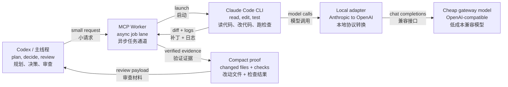

# Promotion Kit

## 2.6.2 launch assets


### 中文发布短文

Codex 应该把精力留给规划、判断和验收，而不是吞完整仓库、反复失败日志和巨大 diff。

**IDE Super Worker 2.6.2** 给 Codex 增加了一条异步证据通道：把搜索、上下文打包、实现循环和检查交给后台 worker；主线程只接收改动文件、检查结果、可选 diff 与可审计的证据。

这版新增 `WORKER_LITE_LLM=0`：标准 `analyze` / `review` 可退化为确定性的证据包，不再让低成本模型替主线程下结论。也就是说，证据交给 worker，判断保留给 Codex。

适合在大型代码库中反复“读代码 → 改代码 → 跑检查”的工作流。它不承诺任何固定节省比例；实际成本和质量应由项目自己的任务与指标验证。

项目地址：<https://github.com/luzmatrix002/ide-super-worker>

### English launch post

Codex should spend its context on planning, judgment, and acceptance—not on swallowing a whole repository, repeated failure logs, and giant diffs.

**IDE Super Worker 2.6.2** adds an asynchronous evidence lane for Codex. Search, context packing, implementation loops, and checks run in a background worker; the main thread receives changed files, checks, optional diffs, and auditable evidence.

This release adds `WORKER_LITE_LLM=0`: standard `analyze` and `review` can return deterministic evidence packs instead of asking a cheap model to make conclusions. The worker gathers evidence; Codex keeps the judgment.

It is built for large codebases with repeated read → edit → test loops. It does not promise a fixed savings percentage—measure cost and quality against your own workload.

Project: <https://github.com/luzmatrix002/ide-super-worker>

## 中文发布短文

我做了一个给 Codex 用的异步 MCP worker：把大文件阅读、代码修复、反复跑测试这些
冗长工作移到低成本 worker，Codex 主线程只接收改动文件、检查结果和必要的摘要。

它不是“再套一层便宜模型”，而是把任务按风险和成本分流：

- `search` 在本地检索，不调用模型；
- `analyze`、`review` 用只读低成本路径；
- `start` 在后台执行读代码、修改和测试循环；
- 主线程只审阅压缩证据，而不是吞完整日志和大 diff。

新增的 `quality_mode:"high"` 采用三分支分析加独立审阅器，并且失败即停止：证据不完整、
输出截断或结论有冲突时会要求人工直接审阅，绝不静默降级。

适合需要在大仓库里反复读、改、测，又不想让主线程被中间过程塞满的场景。项目和完整的
中英文说明：<https://github.com/luzmatrix002/ide-super-worker>

发布时不要宣称“保证省钱”或“质量不降”。更准确的说法是：它通过返回压缩证据，减少大规模
读/改/测循环中需要进入 Codex 主线程的中间上下文；实际成本和质量需由真实任务评估确认。

## Latest Release Angle

IDE Super Worker 2.5.0 is now focused on one practical promise: keep Codex on the high-value planning and review path, and push bulky code-reading, repair, checks, review, and failure diagnosis into a cheaper worker lane.

The current build adds:

- Default compact worker results, with diffs opt-in instead of automatic.
- Cheap read-only `analyze`, zero-LLM `search`, and gateway-backed `review`.
- JSONL metrics plus `npm run stats` for real route/model token accounting.
- Primary/fallback gateway routing with official Anthropic fallback disabled unless explicitly allowed.
- Bounded check output, failure digests, cache-friendly prompts, and controlled revise escalation.
- Optional worktree isolation for parallel jobs.

Sanitized live acceptance snapshot:

- Build, core tests, smoke tests, and network doctor passed.
- Primary and fallback gateways were reachable.
- Real analyze calls were accepted by the configured primary model.
- Fallback analyze succeeded when the primary key was intentionally invalid.
- Packet capture during live analyze traffic showed primary-gateway packets and zero official Anthropic packet events.
- Metrics landed in the configured JSONL file and `npm run stats` aggregated them without extra arguments.

## One-Liner

Make Codex stop eating giant diffs: delegate heavy code work to a cheaper async worker and return only compact, verified results.

让 Codex 少吃大文件和大 diff：把重的读代码、修复、测试循环交给低成本异步 worker，主线程只拿压缩后的证据和结果。

## Image Asset

Use this GitHub-ready visual when posting or embedding the project:


## Short Pitch

Codex is excellent at orchestration and review. It is wasteful to make the main thread ingest every file read, every failed repair attempt, and every huge diff.

IDE Super Worker adds a cheaper background lane. Codex sends a small MCP request, Claude Code runs the task locally, the adapter routes model calls to an OpenAI-compatible gateway, and Codex gets back the clean part: changed files, checks, logs, and an optional diff.

It is built for people who want more AI coding throughput without turning every subtask into a premium-context bonfire.

## Efficiency-Led Positioning

The stronger claim is not only "cheaper model." It is "shorter route."

IDE Super Worker keeps each class of work in its cheapest safe lane:

| Work type | Common competing flow | IDE Super Worker flow |
| --- | --- | --- |
| Find code | Ask an agent to search and summarize. | `search` does bounded local repo search with 0 LLM calls. |
| Explain files | Start a full edit-capable agent loop. | `analyze` reads sandboxed files and makes one cheap gateway call. |
| Review changes | Send large diffs back to the premium thread. | `review` uses the cheap gateway and returns a structured verdict. |
| Implement fixes | Keep the main Codex thread inside the repair loop. | `start` runs async; Codex receives compact evidence. |
| Verify result | Trust a long transcript. | Scoped patch checks, command checks, and routing-contract tests gate the result. |

Use this comparison carefully: frame competitors as workflow categories, not named projects. The point is efficiency architecture, not model-name drama.

## Dead Simple Diagram

```text
Before:
Codex -> reads repo -> edits -> tests -> reads diff -> burns context

After:
Codex -> Worker -> cheap model does heavy loop -> Codex gets summary/checks
```

```text
               small request
Codex --------------------------------> MCP Worker
  ^                                         |
  | compact result                          | launches
  | changed_files + checks                  v
  +---------------------------------- Claude Code
                                            |
                                            | adapter
                                            v
                               cheap OpenAI-compatible gateway
```

## Bilingual Flowchart



## Key Benefits

- Lower Codex token intake by returning compact evidence instead of full intermediate context.
- Use cheaper model gateways for bulk code reading and repair.
- Use zero-LLM `search` before model calls, so discovery costs nothing.
- Keep read-only work read-only: `analyze` and `review` are contract-tested against workspace writes.
- Keep safety rails: sandbox root, scoped patch checks, secret redaction, and permission controls.
- Keep quality rails: test commands, deterministic result assessment, and bounded auto-revise.
- Use `analyze` for fast read-only summaries without launching a full agent loop.

## 中文发布文案

我整理了一个 Codex 省上下文的 MCP worker。

问题很简单：Codex 适合做规划、判断和审查，但读一堆文件、反复修测试、吞大 diff 很费主线程上下文。

这个 worker 把中间那段重活拆出去：Codex 发一个小请求，后台用 Claude Code 跑任务，通过本地 adapter 把模型流量转到 OpenAI 兼容网关。最后 Codex 只拿改动文件、检查结果、日志和可选 diff。

适合三类场景：

- 大仓库里先搜索、再读关键文件。
- bug 修复需要多轮跑测试。
- 代码 review 只想看结构化结论，不想把整段 diff 塞回主线程。

2.5.0 这一版重点是可运营：`read_pack`、`diff_digest`、`shell digest`、`review`、`stats:gate`、工具错误熔断、可靠性档位、技能包校验，以及公开发布前的脱敏清单。

## English Launch Copy

I built IDE Super Worker to keep Codex out of the noisy middle of coding tasks.

Codex is best at planning, deciding, and reviewing. It is expensive to make the main thread read every file, watch every failed fix, ingest every test log, and digest every large patch.

This worker adds a cheaper async lane. Codex sends a small MCP request, Claude Code runs the local loop, the adapter routes model calls to an OpenAI-compatible gateway, and Codex receives compact proof: changed files, checks, logs, and an optional diff.

Version 2.5.0 focuses on operations and trust: `read_pack`, `diff_digest`, worker-side shell digests, cheap-gateway review, stats gates, tool error containment, reliability tiers, skill validation, and a release checklist for public sanitization.

## Iteration Campaign

| Phase | Message | Proof to show | Channel |
| --- | --- | --- | --- |
| Day 1 | "Codex should review proof, not swallow every intermediate step." | README flowchart, `include_diff:false` result, passing tests. | GitHub README, pinned X/LinkedIn post. |
| Day 3 | "Search and read-only analysis do not need a full agent loop." | `search`, `read_pack`, `analyze` examples. | Short thread, Discord MCP communities. |
| Day 7 | "Worker output is auditable." | `diff_digest`, `review`, `shell digest`, `stats:gate`. | Demo video or annotated terminal screenshots. |
| Day 14 | "Operational guardrails matter more than model-name hype." | sandbox root, scoped patches, secret redaction, circuit breaker. | Blog post, Hacker News / Reddit where allowed. |

Do not claim guaranteed cost reduction for every task. Safer wording: "reduces premium main-thread context intake on large read/edit/test loops by returning compact evidence instead of full intermediate context."

## Stronger Positioning

This is not a chatbot wrapper. It is cost-control infrastructure for AI coding:

- Codex stays as the high-quality planner/reviewer.
- Cheap models do the bulky implementation labor.
- Tests and scoped patch checks decide whether the worker earned trust.
- Large diffs become optional instead of the default payload.

The pitch is simple: keep the expensive brain clean; move repetitive muscle work to a cheaper lane.

## Competitor Contrast Copy

Use one of these snippets when you need the efficiency angle to land quickly:

1. Most AI coding setups make the best model do everything: search, read, edit, retry, test, and digest the diff. IDE Super Worker splits the route so Codex only handles the decisions.
2. A cheaper model wrapper lowers unit price, but it does not fix workflow waste. This worker removes waste first: zero-LLM search, one-call read-only analysis, async implementation, compact evidence.
3. The main speedup is not magic. It is queue discipline: discovery stays local, summaries stay cheap, repair loops run in the background, and Codex reviews only the proof.
4. Instead of asking a premium agent to watch every step, make it inspect the receipt: changed files, checks, logs, optional diff.

## Suggested GitHub Description

Cost-saving async MCP worker for Codex: delegate heavy Claude Code loops to cheap OpenAI-compatible gateways and return compact verified results.

## Suggested Topics

`mcp`, `codex`, `claude-code`, `ai-coding`, `openai-compatible`, `developer-tools`, `cost-optimization`, `typescript`

## Launch Post

I built an MCP worker for Codex that changes where the expensive tokens go.

The problem: Codex is great at planning and review, but implementation loops are noisy. Reading lots of files, trying fixes, running tests, and ingesting big diffs can burn premium context fast.

The fix: Codex delegates the noisy middle to a background worker.

The worker launches Claude Code, routes model traffic through a local Anthropic-to-OpenAI adapter, and sends the heavy work to cheaper compatible gateways.

Codex gets back the part it actually needs: changed files, checks, logs, and an optional diff.

Useful pieces:

- async `start/get/tail/wait/cancel` tools
- read-only `analyze` tool for cheap summaries
- zero-LLM `search` for fast repo discovery
- cheap-gateway `review` for structured code review
- 429/5xx retry handling
- `include_diff:false` to avoid dumping large patches into the main thread
- token usage JSONL for real cost tracking
- scoped patch checks and secret redaction
- optional fallback gateway and worktree isolation

If your AI coding workflow is bottlenecked by cost, quota, or long context churn, this is a small piece of plumbing that can buy back a surprising amount of headroom.

Diagram:

```text
Codex planner -> MCP worker -> Claude Code -> cheap gateway
Codex reviewer <- changed files + checks <- worker
```

Efficiency lane:

```text
search:  local, zero LLM
analyze: read-only, one cheap call
start:   async implementation loop
wait:    compact proof back to Codex
```

## Target Audiences

- Codex Desktop power users.
- Developers using Claude Code plus cheaper gateway models.
- Teams trying to reduce AI coding cost without giving up verification.
- MCP builders looking for a practical async worker pattern.

## Promotion Channels

- GitHub README plus Topics.
- X/Twitter launch thread with before/after workflow diagram.
- Hacker News "Show HN" if the repo includes a reproducible demo.
- Reddit: r/LocalLLaMA, r/ClaudeAI, r/OpenAI, r/programming where rules allow.
- Discord communities around MCP, Codex, Claude Code, and local/cheap model gateways.
- A short demo video: one task with `include_diff:false`, `tail`, and checks passing.

## Demo Script

1. Show Codex starting a worker job with `include_diff:false`.
2. Show `tail` streaming progress while Codex stays clean.
3. Show `wait` returning changed files and checks.
4. Show metrics JSONL with gateway token usage.
5. Show a second read-only `analyze` call returning quickly without Claude Code startup.

## Landing Page Headline Options

- Stop feeding Codex giant diffs.
- Give Codex a cheaper worker lane.
- Keep Codex for decisions. Move bulk code work elsewhere.
- The async worker that keeps Codex context clean.
