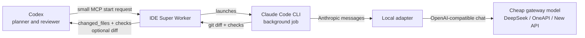

# IDE Super Worker

Stop spending premium Codex context on bulk code reading, patch loops, and giant diffs.

`ide-super-worker` lets Codex delegate the expensive part of a coding task to an async worker running on a cheaper OpenAI-compatible model gateway. Codex stays in charge, but it only receives the compact evidence it needs: changed files, checks, logs, and an optional trimmed diff.

> **2.6 measurement status:** the repository now has paired cost/quality instrumentation and fail-closed acceptance, but no real 10-pair pilot or formal 200-task evaluation is bundled. Treat savings and non-inferiority as unproven until those gates pass; do not expand default automatic routing from this release alone.


## Efficiency First

Most AI coding tools optimize the model call. This project optimizes the route.

The fast path is deliberately split:

- `search` handles repo discovery with zero LLM calls.
- `analyze` and `review` use one cheap gateway call for read-only work.
- `start` moves implementation loops into an async worker so Codex is not blocked by every file read, failed attempt, or test log.
- `get` and `wait` return compact evidence instead of dumping the whole transcript back into the premium thread.

That routing discipline is the efficiency edge: Codex stays focused on planning and review while the worker absorbs the bulky middle.

## The Simple Picture

Without this worker, Codex often pays to ingest everything:

```text
Codex main thread
  -> reads large files
  -> runs repair loops
  -> receives full diffs
  -> burns premium context
```

With this worker, Codex delegates the noisy middle:



Plain version:

```text
Codex asks: "fix this, run tests"
Worker does: read files -> edit -> test -> summarize
Codex gets: files changed + checks passed + optional diff
```

## Why It Exists

Codex is strongest when it coordinates, reviews, and decides. It is not always cost-effective to make the main Codex thread read huge files, run long repair loops, and ingest giant diffs.

This worker changes the shape of the bill:

- Codex sends a compact `start` request.
- Claude Code does the heavy local work in the background.
- The local adapter routes model traffic to your cheaper backend.
- Codex receives `changed_files`, `checks`, logs, and an optional trimmed diff.

For large code-reading and patching tasks, this can cut the expensive main-thread token intake dramatically because Codex no longer has to ingest every intermediate file read and full patch body.

## What Makes It Better Than "Just Use A Cheaper Model"

Cheap models alone are not enough. You still need routing, safety, result shape, and verification.

This project gives you the missing plumbing:

- A Codex-native MCP interface, so delegation is one tool call.
- A Claude Code execution loop, so the worker can actually edit and test.
- A local Anthropic-to-OpenAI adapter, so Claude Code can use cheaper gateways.
- Scope enforcement and check commands, so work is auditable.
- Compact result payloads, so Codex does not swallow unnecessary tokens.
- Metrics, fallback, retries, and optional worktree isolation for real operations.

## Efficiency Comparison

| Workflow | What usually happens | Efficiency gap | IDE Super Worker path |
| --- | --- | --- | --- |
| Direct premium-agent coding | The main agent reads files, retries fixes, sees every test log, and ingests large diffs. | Premium context becomes the workspace transcript. | Codex sends one small task; worker returns changed files, checks, logs, and optional diff. |
| Generic cheaper-model wrapper | A cheaper model runs, but the main agent still needs bulky context and manual verification. | Lower model price, same noisy workflow. | Cheap gateway handles bulk tokens; scoped checks and compact results decide whether work is trustworthy. |
| Full agent loop for read-only questions | Starting an edit-capable loop for summaries and discovery. | Slow startup and unnecessary write surface. | `search` is zero-LLM; `analyze`/`review` are read-only cheap calls. |
| Parallel implementation in one repo | Dirty worktrees collide and review payloads grow. | Coordination overhead eats the gain. | Optional worktree isolation plus scoped patch checks keep jobs separable. |

## Highlights

- Async MCP tools: `start`, `get`, `tail`, `wait`, `cancel`.
- Read-only lite tools: `read_pack`, `analyze`, `diff_digest`, `history`, and `draft` keep bulky reading/review/drafting out of the premium thread. `read_pack` keeps its inline payload at or below 16 KB; when not all slices fit, `truncated:true` signals that the complete pack is available through `receipt.artifact_refs`.
- Code review lite tool: `review` checks diffs/files through the cheap gateway.
- Zero-LLM repo discovery and mechanical work: `search` uses bounded local search, and `apply_edits` handles deterministic replacements without a model call.
- Worker-side command digesting: `shell` can run tests/builds/lint and return a compact failure digest. Test and typecheck exits return public `status:"failed"` with canonical `failure`, `failure_kind`, and `required_action`, while their receipt/metric remains `ok`; timeouts, missing commands, permission failures, and other infrastructure failures remain tool errors.
- Receipt abnormal-output assessment: every receipt carries a deterministic accept/repair verdict and bounded repair guidance without default multi-model voting.
- Runtime tool containment: the worker classifies tool errors, opens per-tool/per-error-class circuits, intercepts unhealthy routes, and uses deterministic fallbacks for `review`/`analyze` when the LLM route is unhealthy.
- Reliability tiers and episode summaries: `start` can record `lite`, `standard`, `strict`, or `critical` expectations without blocking old callers; hard rejection happens only with `blocking_policy:"enforce"`.
- Outcome v1: job-control, rejection, and failure payloads add one versioned semantic outcome while preserving the 2.5 legacy projection.
- Independent semantic verification: `semantic_gate:"required"` performs a dedicated cache-free review and fails closed when evidence is missing or inconclusive.
- Anthropic-to-OpenAI adapter: lets Claude Code talk to OpenAI-compatible gateways.
- 429 and 5xx retry handling with `Retry-After` support.
- Optional `include_diff:false` to return only `changed_files` and `checks`.
- Deterministic verification layer: scope checks, command checks, result signals, and bounded auto-revise.
- Cost telemetry: writes gateway token usage and worker tool-call categories to JSONL when `WORKER_METRICS_FILE` is set.
- Paired evaluation telemetry: validates and imports direct/worker EvalSpan JSONL into a separate `WORKER_EVAL_SPAN_FILE`.
- Optional fallback gateway when the primary provider fails.
- Optional worktree isolation for parallel jobs inside one repository.
- Secret redaction in logs and tool responses.

## Use Cases

Use it when you want Codex to stay sharp instead of stuffed:

| Task | Normal flow | Worker flow |
| --- | --- | --- |
| Fix a bug in a large repo | Codex reads many files and test outputs | Worker reads/edits/tests, Codex reviews compact result |
| Summarize implementation details | Full agent loop may start | `analyze` calls cheap gateway directly |
| Run repeated repair passes | Main thread absorbs every attempt | Worker handles loop and returns final evidence |
| Parallel scoped edits | One dirty worktree gets tangled | Optional git worktree isolation keeps jobs apart |
| Cost accounting | Claude Code cost may be misleading | Gateway token usage is written to JSONL |

## Tool Surface

| Tool | Purpose |
| --- | --- |
| `start` | Start an async Claude Code job in an allowed directory. Supports optional sequential `stages`. |
| `get` | Read current job lifecycle plus authoritative `outcome`; pass `verbose:true` for the full legacy payload. |
| `get_artifact_slice` | Read a bounded redacted slice from an artifact referenced by a worker receipt. Artifact refs are process-local and may expire after an MCP worker restart. |
| `tail` | Read recent worker logs. |
| `wait` | Wait for completion without killing the job on poll timeout; a poll timeout keeps `outcome.status="running"`. |
| `cancel` | Kill a running job process tree. |
| `analyze` | Read-only cheap-model analysis for selected files or bounded globs. |
| `review` | Cheap-model review of a job diff/checks or selected files, returning a structured verdict. |
| `search` | Zero-LLM bounded repository search using `rg` when available. |
| `read_pack` | Zero-LLM context packer for selected paths; returns up to 16 KB of ordered symbol/keyword slices and stores the complete pack behind an artifact ref. |
| `diff_digest` | Summarize current git diff by file, hunk headers, and risk; optionally run cheap red-team review. |
| `shell` | Run bounded worker-side commands with optional `digest:true` for test/build/lint output. |
| `apply_edits` | Zero-LLM literal or regex replacements with replacement-count checks. |
| `history` | Bounded git log/blame timeline for file or line archaeology. |
| `draft` | Draft commit messages, PR descriptions, changelog notes, or release notes from the current diff. |

## Quick Start

```powershell
npm install
npm run build
npm run test
npm run smoke
```

Create a local `.env` from `.env.example` or set environment variables in your shell. Never commit real keys.

```powershell
setx ONEAPI_API_KEY "your-provider-key"
setx ONEAPI_BASE_URL "https://your-gateway.example.com/v1"
setx SANDBOX_ROOT "D:/workspaces"
```

Then run:

```powershell
npm run doctor
npm run doctor:network
```

## Codex Desktop Config

Copy and adapt `codex-mcp.example.toml` into your Codex config.

```toml
[mcp_servers.codex_async_worker]
command = "node"
args = ["D:/path/to/ide-super-worker/dist/index.js"]
cwd = "D:/path/to/ide-super-worker"
startup_timeout_sec = 10
tool_timeout_sec = 3600
env = { SANDBOX_ROOT = "D:/workspaces", ONEAPI_BASE_URL = "https://your-gateway.example.com/v1", CLAUDE_MODEL = "deepseek-v4-flash", CLAUDE_CODE_MODEL = "sonnet", WORKER_SEMANTIC_REVIEW_MODEL = "deepseek-v4-pro", CLAUDE_PERMISSION_MODE = "acceptEdits", USE_OPENAI_ADAPTER = "1", WAIT_DEFAULT_MS = "1800000" }
env_vars = ["ONEAPI_API_KEY"]
```

## Example Job

```json
{
  "prompt": "Fix the failing tests with the smallest safe code change.",
  "allowed_dirs": ["D:/workspaces/my-project"],
  "model": "deepseek-v4-flash",
  "permission_mode": "acceptEdits",
  "include_diff": false,
  "verification_policy": { "version": 1, "task_kind": "modifying" },
  "semantic_gate": "required",
  "scoped_patch": {
    "paths": ["src", "tests"],
    "max_diff_bytes": 20000
  },
  "checks": [
    { "name": "unit tests", "command": "npm test", "timeout_ms": 600000 }
  ]
}
```

Typical result:

```json
{
  "contract_version": "outcome.v1",
  "outcome": {
    "status": "accepted",
    "reason_codes": ["verification_passed"],
    "verification": {
      "executor": "passed",
      "scope": "passed",
      "checks": "passed",
      "semantic": "passed"
    }
  },
  "job_status": "completed",
  "changed_files": ["src/a.ts", "tests/a.test.ts"],
  "checks": ["scoped_patch: passed (src, tests)", "unit tests: passed"],
  "diff": ""
}
```

`outcome` is authoritative for acceptance. `job_status`, `status`, `receipt`, `abnormal`, and the verbose result retain their 2.5 meanings as compatibility projections; they remain throughout 2.x for at least 90 days and can only be removed in 3.0. A legacy request without `verification_policy` still executes, but its Outcome cannot become `accepted`.

Outcome v1 also fails closed as `needs_evidence` when the starting worktree is already dirty, Git cannot provide a reliable change summary, reviewer input is truncated, or a multi-stage pipeline lacks complete prior-stage evidence. Legacy execution is not blocked, but those cases are not claimed as accepted.

Outcome v1 workspace evidence is Git-based. Jobs with additional writable roots cannot become `accepted`, and Git-ignored file contents or side effects outside the workspace are not attested in 2.6. Prefer isolated worktrees and keep ignored/runtime data out of the declared modification scope; full WorkspaceCapsule evidence remains a later iteration.

Use `include_diff:false` by default when Codex only needs to decide whether the job succeeded. Ask for the diff only when you actually need to review patch details.

## Cost Controls

This project stacks several cost controls:

These controls reduce main-thread context, payload size, and accounting noise; they do not impose a spend ceiling on the worker LLM. Primary, fallback, and escalation models are chosen by capability and reliability configuration, not by price gates. `WORKER_PRICE_*` values are for reporting only and must not downgrade, block, or skip fallback/escalation usage.

- `include_diff:false` reduces high-cost Codex ingestion.
- `DIFF_MAX_BYTES` caps patch payloads.
- `INCLUDE_DIFF_DEFAULT=0` makes omitted `include_diff` behave like `false`.
- `CHECK_OUTPUT_RESPONSE_MAX` keeps failed check output compact in `get`/`wait` responses while `tail` retains fuller logs.
- `analyze` skips Claude Code for read-only summaries.
- `search` handles symbol/file discovery without any LLM call.
- `review` and `WORKER_FAILURE_DIGEST=1` move diff review and failure diagnosis to the cheaper gateway.
- `read_pack`, `diff_digest`, `shell digest`, `apply_edits`, `history`, and `draft` move the remaining high-token planning/review chores into worker lanes.
- `WORKER_METRICS_FILE` records real gateway token usage plus `event=tool_call` rows for zero-LLM worker calls.
- `WORKER_EVAL_SPAN_FILE` stores validated paired-evaluation records separately; it never falls back to `JobResult.total_cost_usd`.
- `WORKER_ESCALATE_MODEL` upgrades only failed, difficult revise passes.
- `WORKER_RELIABILITY_TIER`, `WORKER_BLOCKING_POLICY`, `WORKER_SEMANTIC_GATE`, and `WORKER_TOOL_BUDGET` record reliability expectations and blocking risk. Defaults are observe-only to avoid surprise stalls.
- `WORKER_ISOLATION=worktree` allows safe parallel work in one repo.
- Prompt-cache-friendly usage keeps stable instructions before dynamic task text.

Claude Code's own `total_cost_usd` may reflect Anthropic pricing, not your gateway pricing. Use `WORKER_METRICS_FILE` and provider prices for real accounting.

## Cost-Saving Checklist

For best results:

1. Set `include_diff:false` for delegated implementation tasks.
2. Keep `scoped_patch.paths` narrow.
3. Add concrete `checks` so the worker proves completion.
4. Use `analyze` for read-only questions.
5. Enable `WORKER_METRICS_FILE` and compare token usage by route/model.
6. Use `read_pack` instead of full-file reads and `diff_digest` instead of full diff ingestion.
7. Use `shell` with `digest:true` for tests/builds/lint so command output is summarized before Codex sees it.
8. Keep `start` below 30% of worker calls; use finer tools for search, reading, diff digestion, history, drafts, and mechanical edits.
9. Treat receipt `abnormal.verdict !== "accept"` as a repair signal before considering multi-model parallel review. For `shell`, use `failure_kind` and `required_action` first; do not escalate to the main model just because the command exit code is non-zero.
10. Use a fit-for-task default model and reserve `WORKER_ESCALATE_MODEL` for difficult revise passes; do not downgrade primary, fallback, or escalation models because of cost.

## Important Environment Variables

For less common stats, cache, reliability, and circuit-breaker settings, see [Advanced Configuration](docs/advanced-config.md).

| Variable | Purpose |
| --- | --- |
| `SANDBOX_ROOT` | Root directory allowed for worker jobs and `analyze` file reads. |
| `ONEAPI_BASE_URL` / `ANTHROPIC_BASE_URL` | Primary gateway URL. |
| `ONEAPI_API_KEY` / `ANTHROPIC_API_KEY` | Primary gateway key. Keep it out of git. |
| `CLAUDE_MODEL` / `ANTHROPIC_MODEL` | Real backend model used by the gateway. |
| `CLAUDE_CODE_MODEL` | Model name passed to Claude Code for local validation, usually `sonnet`. |
| `USE_OPENAI_ADAPTER` | `1` to use the local Anthropic-to-OpenAI adapter. |
| `MAX_RUNNING_JOBS` | Worker concurrency limit, default `4`, clamped to `1-100`. |
| `DIFF_MAX_BYTES` | Maximum returned diff size. |
| `INCLUDE_DIFF_DEFAULT` | Default for omitted `include_diff`; set `0` to omit diffs unless explicitly requested. |
| `CHECK_OUTPUT_RESPONSE_MAX` | Per-check output cap for compact `get`/`wait` responses. |
| `WORKER_METRICS_FILE` | Optional JSONL path for token usage metrics. |
| `WORKER_EVAL_SPAN_FILE` | Optional, separate JSONL path for validated direct/worker EvalSpan records. |
| `WORKER_EVAL_SUITE_ID` / `WORKER_EVAL_TASK_ID` / `WORKER_EVAL_RUN_ID` / `WORKER_EVAL_ARM` | Optional correlation context appended to worker metrics during isolated eval runs. |
| `WORKER_PRICE_INPUT` / `WORKER_PRICE_OUTPUT` / `WORKER_PRICE_CACHE` | Optional USD-per-1M-token prices used by `npm run stats`; accounting only, never a worker LLM cost gate. |
| `WORKER_PRICE_TABLE` | Optional JSON model price overrides for `npm run stats`; must not affect primary/fallback/escalation selection. |
| `WORKER_FAILURE_DIGEST` | Set `1` to generate a cheap-gateway diagnosis on failed jobs. |
| `WORKER_DIGEST_BEFORE_REVISE` | Set `0` to avoid generating a failure digest before auto-revise. |
| `WORKER_LITE_MODEL` | Optional cheaper model for `analyze`, `review`, and `failure_digest`. |
| `WORKER_LITE_CACHE_DIR` | Optional disk cache directory for lite read-only tools; must be inside `SANDBOX_ROOT`. |
| `WORKER_LITE_CACHE_TTL_MS` | TTL for lite disk cache entries, default `3600000`; `0` bypasses cache. |
| `ADAPTER_PREFIX_CACHE` | Set `1` to use prefix-cache-friendly `analyze` messages. |
| `WORKER_FALLBACK_WARN_EVERY` | Warn every N fallback calls; default `5`, `0` disables. |
| `WORKER_OVERALL_TOOL_ERROR_MAX_PCT` | Gate threshold for total worker tool error rate; default `5`, and the rate must stay below this value. |
| `WORKER_SINGLE_TOOL_ERROR_MAX_PCT` | Gate threshold for each individual tool's error rate; default `3`, and the rate must stay below this value. |
| `WORKER_CATEGORY_ERROR_MAX_PCT` | Gate threshold for category-level tool error rate; default `5`. `WORKER_TOOL_ERROR_MAX_PCT` remains as a legacy alias. |
| `WORKER_TOOL_ERROR_MIN_CALLS` | Minimum sample count before category or single-tool error-rate gates apply; default `10`. |
| `WORKER_TOOL_REVIEW_INTERVAL_MS` | Runtime tool error-rate review interval while the MCP server is running; default `10800000` (3 hours). |
| `WORKER_TOOL_REVIEW_SINCE_MINUTES` | Review window for runtime tool error-rate control; default `180`. |
| `WORKER_TOOL_REVIEW_GRACE_MS` | How late a scheduled review can run before it is treated as overdue; default `300000`. |
| `WORKER_TOOL_REVIEW_DISABLED` | Set `1` to disable the runtime review loop. |
| `WORKER_TOOL_CIRCUIT_BREAKER` | Active runtime containment switch; default enabled. Set `0` to disable per-tool/per-error-class circuits. |
| `WORKER_TOOL_CIRCUIT_WINDOW_MS` | Rolling window for immediate circuit decisions; default `900000`. |
| `WORKER_TOOL_CIRCUIT_OPEN_MS` | How long an opened circuit intercepts the unhealthy route; default `600000`. |
| `WORKER_TOOL_CIRCUIT_MIN_CALLS` | Minimum calls before generic per-tool error-rate circuits can open; default `3`. |
| `WORKER_TOOL_CIRCUIT_MIN_ERRORS` | Minimum errors before generic per-tool circuits can open; default `2`. |
| `WORKER_TOOL_ERROR_CLASS_CIRCUIT_MIN_ERRORS` | Minimum same-class errors before a per-error-class circuit can open; default `1`. |
| `WORKER_TOOL_CIRCUIT_IMMEDIATE_CLASSES` | Comma-separated classes that open a circuit immediately; default `upstream_404,search_timeout,shell_mismatch`. |
| `WORKER_TOOL_CIRCUIT_STATE_FILE` | Optional persisted circuit state path. Defaults to `WORKER_METRICS_FILE + ".state.json"` so open circuits and a bounded rolling-event snapshot survive MCP restarts. |
| `WORKER_TOOL_CIRCUIT_STATE_EVENT_MAX` | Maximum recent tool-control events persisted with circuit state; default `200`, set `0` to persist only open circuits. |
| `WORKER_TOOL_CIRCUIT_STATE_SAVE_MIN_MS` | Minimum interval for non-error state snapshots; default `30000`. Errors and circuit opens force a save. |
| `WORKER_TOOL_CIRCUIT_STATE_LOCK_STALE_MS` | Best-effort state lock stale threshold; default `30000`. Lock contention skips the snapshot instead of blocking tool calls. |
| `WORKER_ESCALATE_MODEL` | Optional stronger model for hard revise passes. |
| `WORKER_RELIABILITY_TIER` | Default `start` reliability profile: `lite`, `standard`, `strict`, or `critical`; default `standard`. |
| `WORKER_BLOCKING_POLICY` | How missing reliability gates behave: `observe`, `warn`, or `enforce`; default `observe`. |
| `WORKER_SEMANTIC_GATE` | Declared semantic-review expectation: `off`, `warn`, or `required`; critical jobs default to `warn`. |
| `WORKER_SEMANTIC_REVIEW_MODEL` | Dedicated model used for the independent semantic verifier. Required for a `required` gate to pass. |
| `WORKER_SEMANTIC_REVIEW_TIMEOUT_MS` | End-to-end semantic-review deadline, default `60000`, capped at 5 minutes. |
| `WORKER_TOOL_BUDGET` | Optional advisory max tool-call budget recorded in metrics and reliability profile. |
| `WORKER_ISOLATION` | Set to `worktree` for per-job git worktree isolation. |
| `FALLBACK_BASE_URL` / `FALLBACK_API_KEY` | Optional fallback gateway. |
| `FALLBACK_MODELS` | Optional comma-separated fallback model pool, capped at 3 model candidates for bounded routing. Overrides `FALLBACK_MODEL` / `FALLBACK_ESCALATE_MODEL` when set; not a cost cap. |

## Security Model

- All job paths must resolve inside `SANDBOX_ROOT`.
- `scoped_patch` rejects changes outside declared paths.
- `bypassPermissions` is blocked unless explicitly enabled with `ALLOW_BYPASS_PERMISSIONS=1`.
- Secrets are redacted from logs and tool responses.
- `.env`, archives, logs, `node_modules`, and `dist` are gitignored.

See [SECURITY.md](SECURITY.md) for responsible disclosure and operational notes.

## Validation

```powershell
npm run build
npm run test
npm run smoke
npm run doctor:network
npm run skills:validate
npm run eval:contracts
npm run eval:fixtures
npm run codex:audit -- --since-minutes=60
npm run codex:guard
```

`doctor:network` depends on your real gateway credentials. Build, test, and smoke should pass offline.

`npm run codex:audit -- --since-minutes=60` checks recent worker metrics, receipt artifact coverage, the persisted `AGENTS.md` routing rules, fallback usage, and worker category evidence. It also prints the known blind spot: direct main-thread shell output, full-file reads, chat context, and pasted prompts are outside `WORKER_METRICS_FILE`.

`npm run codex:guard` runs the local Codex audit and then `stats:gate`.

`npm run eval:contracts` validates the EvalSpan v1 importer and paired/pilot fail-closed rules. `npm run eval:fixtures` verifies the frozen 10-task pilot corpus and its SHA-256. Import external usage with `npm run eval:gate -- --import producer.jsonl --out .eval/eval-spans.jsonl`; gate a completed pilot with `npm run eval:gate -- --input .eval/eval-spans.jsonl --mode pilot`. `WORKER_METRICS_FILE` is operational telemetry, not a substitute for the required raw provider export for non-zero worker-model usage; without that provider export, the pilot is incomplete. The pilot proves measurement completeness only, not cost savings or quality non-inferiority. The full producer and formal-manifest contract is in [eval/README.md](eval/README.md); run the preregistered 200-400 task gate with `npm run eval:formal -- --input <spans.jsonl> --manifest <manifest.json>`.

`npm run skills:validate` checks the project-specific `.claude/skills/` library used to preserve project doctrine for cheaper or lower-context worker sessions.

`npm run stats` reports gateway token usage, receipt byte/artifact usage, and a Worker Tool Audit. `npm run stats:gate -- <metrics.jsonl>` turns the same thresholds into hard gates with exit code 2 on failure. Category targets are: search 80%, context_pack 70%, command_digest 70%, diff_digest 60%, review 60%, mechanical_edit 50%, history 60%, draft 80%, analysis 60%, and `start` must stay at or below 30% of worker calls. Gate mode also fails if required categories have no audit evidence, overall tool error rate is 5% or higher, any single tool error rate is 3% or higher after the sample floor, fallback ratio exceeds 10%, large receipt payloads lack artifact refs, or `diff_digest` red-team coverage falls below 30%. Tool error rate is reserved for worker/tool execution failures; shell command failures are recorded as `command_status` with local repair guidance, and stale job ids or invalid caller inputs are recorded as `rejected`.

When the MCP server is running, it also reviews recent tool error rates every 3 hours by default. A threshold breach, or a review that runs later than `WORKER_TOOL_REVIEW_GRACE_MS`, enables escalation self-heal defaults for later `start` calls: `reliability_tier=strict`, `blocking_policy=warn`, `semantic_gate=warn`, `auto_revise=true`, and at least one revise pass. Explicit `start` arguments still win over these defaults.

Runtime containment is more aggressive than the 3-hour review. Every tool result updates an in-memory rolling window. Real tool execution errors are classified (`upstream_404`, `upstream_error`, `shell_mismatch`, `search_timeout`, `timeout`, `missing_command`, `missing_path`, `permission_denied`, `dependency_missing`, or `unknown_failure`). Repeated errors, or any immediate-class error, open a temporary circuit. While open, unhealthy routes are intercepted as `rejected` instead of producing more errors; `review` and `analyze` degrade to deterministic local evidence when possible. Open circuits and a bounded rolling-event snapshot are persisted to a state sidecar file and reloaded on MCP startup or the next tool-control decision, so restarts do not immediately forget an unhealthy route or a tool already close to its circuit threshold. To keep the hot path cheap, OK outcomes are snapshotted only after `WORKER_TOOL_CIRCUIT_STATE_SAVE_MIN_MS`; errors and circuit opens force a save. Shell command business failures still record `command_status` and do not count as tool errors. On Windows, PowerShell-shaped shell commands accidentally sent through `cmd.exe` are retried once through `powershell -NoProfile -ExecutionPolicy Bypass -Command`.

Additional redundancy that is already in place:

- Gate redundancy: `codex:guard` combines recent routing audit evidence with `stats:gate`.
- Route redundancy: `review`/`analyze` can fall back to local deterministic evidence while LLM review routes are unhealthy.
- Shell redundancy: shell mismatch is retried once through the matching Windows shell before surfacing failure.
- State redundancy: circuit state is atomically written with a temp file plus rename, protected by a best-effort lock, guarded by a checksum, and pruned on load. Corrupt, mismatched, or expired state is ignored and rewritten instead of crashing the MCP server.
- Restart redundancy: a small rolling-event snapshot is restored with open circuits so a restart does not erase tools that are already near a circuit threshold.
- Efficiency guardrail: state writes are bounded by event count and save interval; lock contention skips a snapshot instead of delaying the worker.

The routing contract tests lock the core money/safety invariants:

- I3: no predictive classifier call before routing.
- I5: identical read-only requests hit cache; primary failure plus fallback records one successful upstream.
- I6: read-only tools do not write to the workspace.

The smoke test also verifies the current tool surface: `analyze`, `apply_edits`, `cancel`, `diff_digest`, `draft`, `get`, `get_artifact_slice`, `history`, `read_pack`, `review`, `search`, `shell`, `start`, `tail`, and `wait`.

## When To Use It

Use this worker for:

- long codebase reading tasks,
- scoped code edits with tests,
- repeated repair loops,
- cheap model summaries,
- background implementation while Codex continues planning/reviewing.

Keep the main Codex thread for high-level decisions, code review, final integration, and tasks that require your most capable model directly.

## Attribution

This project builds on ideas from several sources:

- **Latent-recurrent reasoning depth** — Geiping et al., 2025. The deterministic relaxation approach in `src/reasoning.ts` adapts the "relax a belief toward a fixed point" idea to code-worker execution signals (checks, scope, exit code, diff, stderr).
- **Mythos reasoning architecture** — The plan → recurrent depth → verify → calibrate → contradiction → gate pipeline is a self-contained port adapted to concrete execution signals. The code runs no LLM and makes no network calls.
- **Claude Code** by Anthropic — used as the background execution engine for worker jobs.
- **Model Context Protocol (MCP)** — the open protocol this worker implements.

All source code in this repository is original work by the project maintainer. The adapted algorithms are clearly documented in code comments with their origin.

## License

MIT — see [LICENSE](LICENSE).
