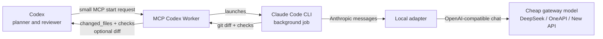

# MCP Codex Worker

Stop spending premium Codex context on bulk code reading, patch loops, and giant diffs.

`mcp-codex-worker` lets Codex delegate the expensive part of a coding task to an async worker running on a cheaper OpenAI-compatible model gateway. Codex stays in charge, but it only receives the compact evidence it needs: changed files, checks, logs, and an optional trimmed diff.

## The Simple Picture

Without this worker, Codex often pays to ingest everything:

```text
Codex main thread
  -> reads large files
  -> runs repair loops
  -> receives full diffs
  -> burns premium context
```

With this worker, Codex delegates the noisy middle:



Plain version:

```text
Codex asks: "fix this, run tests"
Worker does: read files -> edit -> test -> summarize
Codex gets: files changed + checks passed + optional diff
```

## Why It Exists

Codex is strongest when it coordinates, reviews, and decides. It is not always cost-effective to make the main Codex thread read huge files, run long repair loops, and ingest giant diffs.

This worker changes the shape of the bill:

- Codex sends a compact `start` request.
- Claude Code does the heavy local work in the background.
- The local adapter routes model traffic to your cheaper backend.
- Codex receives `changed_files`, `checks`, logs, and an optional trimmed diff.

For large code-reading and patching tasks, this can cut the expensive main-thread token intake dramatically because Codex no longer has to ingest every intermediate file read and full patch body.

## What Makes It Better Than "Just Use A Cheaper Model"

Cheap models alone are not enough. You still need routing, safety, result shape, and verification.

This project gives you the missing plumbing:

- A Codex-native MCP interface, so delegation is one tool call.
- A Claude Code execution loop, so the worker can actually edit and test.
- A local Anthropic-to-OpenAI adapter, so Claude Code can use cheaper gateways.
- Scope enforcement and check commands, so work is auditable.
- Compact result payloads, so Codex does not swallow unnecessary tokens.
- Metrics, fallback, retries, and optional worktree isolation for real operations.

## Highlights

- Async MCP tools: `start`, `get`, `tail`, `wait`, `cancel`.
- Read-only lite tool: `analyze` answers file-summary questions without launching Claude Code.
- Anthropic-to-OpenAI adapter: lets Claude Code talk to OpenAI-compatible gateways.
- 429 and 5xx retry handling with `Retry-After` support.
- Optional `include_diff:false` to return only `changed_files` and `checks`.
- Deterministic verification layer: scope checks, command checks, result signals, and bounded auto-revise.
- Cost telemetry: writes gateway token usage to JSONL when `WORKER_METRICS_FILE` is set.
- Optional fallback gateway when the primary provider fails.
- Optional worktree isolation for parallel jobs inside one repository.
- Secret redaction in logs and tool responses.

## Use Cases

Use it when you want Codex to stay sharp instead of stuffed:

| Task | Normal flow | Worker flow |
| --- | --- | --- |
| Fix a bug in a large repo | Codex reads many files and test outputs | Worker reads/edits/tests, Codex reviews compact result |
| Summarize implementation details | Full agent loop may start | `analyze` calls cheap gateway directly |
| Run repeated repair passes | Main thread absorbs every attempt | Worker handles loop and returns final evidence |
| Parallel scoped edits | One dirty worktree gets tangled | Optional git worktree isolation keeps jobs apart |
| Cost accounting | Claude Code cost may be misleading | Gateway token usage is written to JSONL |

## Tool Surface

| Tool | Purpose |
| --- | --- |
| `start` | Start an async Claude Code job in an allowed directory. Supports optional sequential `stages`. |
| `get` | Read current job status and compact structured result; pass `verbose:true` for the full legacy payload. |
| `tail` | Read recent worker logs. |
| `wait` | Wait for completion without killing the job on timeout; pass `verbose:true` for the full legacy payload. |
| `cancel` | Kill a running job process tree. |
| `analyze` | Read-only cheap-model analysis for selected files or bounded globs. |
| `review` | Cheap-model review of a job diff/checks or selected files, returning a structured verdict. |
| `search` | Zero-LLM bounded repository search using `rg` when available. |

## Quick Start

```powershell
npm install
npm run build
npm run test
npm run smoke
```

Create a local `.env` from `.env.example` or set environment variables in your shell. Never commit real keys.

```powershell
setx ONEAPI_API_KEY "your-provider-key"
setx ONEAPI_BASE_URL "https://your-gateway.example.com/v1"
setx SANDBOX_ROOT "D:/workspaces"
```

Then run:

```powershell
npm run doctor
npm run doctor:network
```

## Codex Desktop Config

Copy and adapt `codex-mcp.example.toml` into your Codex config.

```toml
[mcp_servers.codex_async_worker]
command = "node"
args = ["D:/path/to/mcp-codex-worker/dist/index.js"]
cwd = "D:/path/to/mcp-codex-worker"
startup_timeout_sec = 10
tool_timeout_sec = 3600
env = { SANDBOX_ROOT = "D:/workspaces", ONEAPI_BASE_URL = "https://your-gateway.example.com/v1", CLAUDE_MODEL = "deepseek-v4-flash", CLAUDE_CODE_MODEL = "sonnet", CLAUDE_PERMISSION_MODE = "acceptEdits", USE_OPENAI_ADAPTER = "1", WAIT_DEFAULT_MS = "1800000" }
env_vars = ["ONEAPI_API_KEY"]
```

## Example Job

```json
{
  "prompt": "Fix the failing tests with the smallest safe code change.",
  "allowed_dirs": ["D:/workspaces/my-project"],
  "model": "deepseek-v4-flash",
  "permission_mode": "acceptEdits",
  "include_diff": false,
  "scoped_patch": {
    "paths": ["src", "tests"],
    "max_diff_bytes": 20000
  },
  "checks": [
    { "name": "unit tests", "command": "npm test", "timeout_ms": 600000 }
  ]
}
```

Typical result:

```json
{
  "job_status": "completed",
  "changed_files": ["src/a.ts", "tests/a.test.ts"],
  "checks": ["scoped_patch: passed (src, tests)", "unit tests: passed"],
  "diff": ""
}
```

Use `include_diff:false` by default when Codex only needs to decide whether the job succeeded. Ask for the diff only when you actually need to review patch details.

## Cost Controls

This project stacks several cost controls:

- `include_diff:false` reduces high-cost Codex ingestion.
- `DIFF_MAX_BYTES` caps patch payloads.
- `INCLUDE_DIFF_DEFAULT=0` makes omitted `include_diff` behave like `false`.
- `CHECK_OUTPUT_RESPONSE_MAX` keeps failed check output compact in `get`/`wait` responses while `tail` retains fuller logs.
- `analyze` skips Claude Code for read-only summaries.
- `search` handles symbol/file discovery without any LLM call.
- `review` and `WORKER_FAILURE_DIGEST=1` move diff review and failure diagnosis to the cheaper gateway.
- `WORKER_METRICS_FILE` records real gateway token usage.
- `WORKER_ESCALATE_MODEL` upgrades only failed, difficult revise passes.
- `WORKER_ISOLATION=worktree` allows safe parallel work in one repo.
- Prompt-cache-friendly usage keeps stable instructions before dynamic task text.

Claude Code's own `total_cost_usd` may reflect Anthropic pricing, not your gateway pricing. Use `WORKER_METRICS_FILE` and provider prices for real accounting.

## Cost-Saving Checklist

For best results:

1. Set `include_diff:false` for delegated implementation tasks.
2. Keep `scoped_patch.paths` narrow.
3. Add concrete `checks` so the worker proves completion.
4. Use `analyze` for read-only questions.
5. Enable `WORKER_METRICS_FILE` and compare token usage by route/model.
6. Use a cheap default model and reserve `WORKER_ESCALATE_MODEL` for difficult revise passes.

## Important Environment Variables

| Variable | Purpose |
| --- | --- |
| `SANDBOX_ROOT` | Root directory allowed for worker jobs and `analyze` file reads. |
| `ONEAPI_BASE_URL` / `ANTHROPIC_BASE_URL` | Primary gateway URL. |
| `ONEAPI_API_KEY` / `ANTHROPIC_API_KEY` | Primary gateway key. Keep it out of git. |
| `CLAUDE_MODEL` / `ANTHROPIC_MODEL` | Real backend model used by the gateway. |
| `CLAUDE_CODE_MODEL` | Model name passed to Claude Code for local validation, usually `sonnet`. |
| `USE_OPENAI_ADAPTER` | `1` to use the local Anthropic-to-OpenAI adapter. |
| `DIFF_MAX_BYTES` | Maximum returned diff size. |
| `INCLUDE_DIFF_DEFAULT` | Default for omitted `include_diff`; set `0` to omit diffs unless explicitly requested. |
| `CHECK_OUTPUT_RESPONSE_MAX` | Per-check output cap for compact `get`/`wait` responses. |
| `WORKER_METRICS_FILE` | Optional JSONL path for token usage metrics. |
| `WORKER_FAILURE_DIGEST` | Set `1` to generate a cheap-gateway diagnosis on failed jobs. |
| `WORKER_ESCALATE_MODEL` | Optional stronger model for hard revise passes. |
| `WORKER_ISOLATION` | Set to `worktree` for per-job git worktree isolation. |
| `FALLBACK_BASE_URL` / `FALLBACK_API_KEY` | Optional fallback gateway. |

## Security Model

- All job paths must resolve inside `SANDBOX_ROOT`.
- `scoped_patch` rejects changes outside declared paths.
- `bypassPermissions` is blocked unless explicitly enabled with `ALLOW_BYPASS_PERMISSIONS=1`.
- Secrets are redacted from logs and tool responses.
- `.env`, archives, logs, `node_modules`, and `dist` are gitignored.

See [SECURITY.md](SECURITY.md) for responsible disclosure and operational notes.

## Validation

```powershell
npm run build
npm run test
npm run smoke
npm run doctor:network
```

`doctor:network` depends on your real gateway credentials. Build, test, and smoke should pass offline.

## When To Use It

Use this worker for:

- long codebase reading tasks,
- scoped code edits with tests,
- repeated repair loops,
- cheap model summaries,
- background implementation while Codex continues planning/reviewing.

Keep the main Codex thread for high-level decisions, code review, final integration, and tasks that require your most capable model directly.
