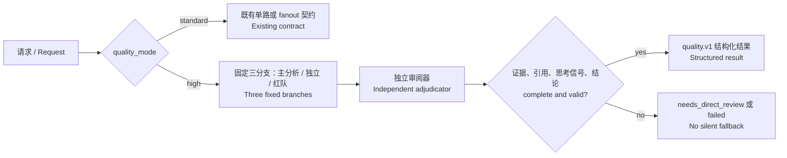
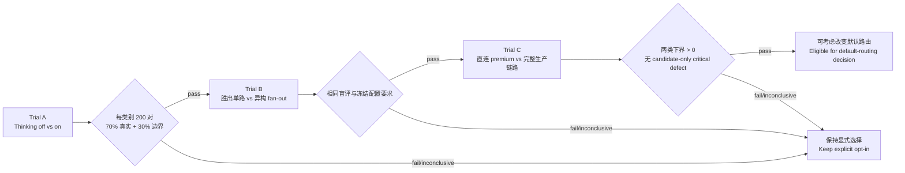

# 质量优先迭代说明 / Quality-first iteration guide

本版本新增可选的 `quality_mode:"high"`。它为 `analyze` 与 `review` 提供
**失败即停止（fail-closed）** 的高质量路径；默认仍是原有 `standard` 路径。

This release adds the optional `quality_mode:"high"` for `analyze` and
`review`. It is a **fail-closed** quality path; the existing `standard` path
remains the default.

## 1. 运行时闭环 / Runtime flow



高质量模式必须使用恰好三个已配置分支，且审阅器不能与任一分支复用
endpoint/model 组合。每次请求会绕过 Lite 缓存，要求可观察的 reasoning
signal，并拒绝截断输出、空答案、模型不匹配、无效引用、未裁决分歧或被掩盖的
高/严重风险项。

High mode requires exactly three configured branches and a reviewer whose
endpoint/model pair is distinct from every branch. It bypasses the Lite cache,
requires an observable reasoning signal, and rejects truncated or empty output,
model mismatches, invalid citations, unadjudicated disagreements, and masked
high/critical findings.

## 2. 可靠性与效率改进 / Reliability and efficiency changes

| 迭代 / Iteration | 细节 / Detail | 用户影响 / User impact |
| --- | --- | --- |
| 并发取消 / Cancellation | 本地 FIFO 信号量支持 `AbortSignal`，已取消的排队请求会移出队列。 | 不会让已取消请求占用后续容量。 / Cancelled requests no longer consume later capacity. |
| 可观测性 / Observability | Lite 成功与缓存记录队列等待、上游、端到端耗时及尝试次数。 | 可定位慢在排队、服务商还是重试。 / Latency can be attributed to queueing, upstream work, or retries. |
| 生命周期 / Lifecycle | 无运行任务时，worker 默认 5 分钟空闲后退出；`WORKER_IDLE_EXIT_MS=0` 可关闭。 | 减少长期空闲进程；每个 MCP 请求会刷新计时器。 / Reduces idle processes; each request refreshes the timer. |
| 失败语义 / Failure semantics | `codex:audit`、`stats:gate`、`codex:guard` 的策略失败分类为可修复 gate failure。 | 调用方能区分策略门禁与工具崩溃。 / Callers can distinguish policy gates from tool crashes. |

高质量路径的内部截止时间是 270 秒：15 秒获取队列、195 秒供分支共享、余下时间
给审阅器；调用方保留五分钟预算中的 30 秒进行传输清理。

The high-quality path has a 270-second internal deadline: 15 seconds for queue
acquisition, 195 seconds shared by branches, and the remainder for review. The
caller retains 30 seconds of a five-minute budget for transport cleanup.

## 3. 三阶段资格验证 / Three-stage qualification



资格验证按 `analyze_diagnosis` 与 `review` 分开评估。官方观察点为每类别
200 对（alpha 0.01），可选 500 对（alpha 0.015）；bootstrap 以完整仓库为
重采样单位。任何 candidate-only critical defect 立即失败。配置指纹漂移、未声明
盲评或真实/边界比例不符都会使试验无效。

Qualification is separate for `analyze_diagnosis` and `review`. Official looks
are 200 pairs per category (alpha 0.01), with an optional 500-pair look
(alpha 0.015); bootstrap resampling is by whole repository. Any candidate-only
critical defect fails immediately. Configuration-fingerprint drift, undeclared
blind evaluation, or an invalid real/edge mix invalidates the trial.

## 4. 使用与发布边界 / Use and release boundary

```powershell
# 运行资格验证 / Run the qualification gate
npm run eval:quality -- --input .eval/quality/pairs.jsonl

# 发布前验证 / Release checks
npm test
npm run codex:guard
```

单元测试通过、工程试点完成，或单次高质量请求成功，**都不构成** 质量认证或默认
启用授权。只有真实且冻结的任务、盲评、保留证据，以及通过 Trial A → B → C 的
资格门禁后，才可以讨论改变默认路由。

Passing unit tests, completing an engineering pilot, or seeing one successful
high-mode request **does not** certify quality or authorize a default change.
Only real frozen tasks, blind evaluation, retained evidence, and a passed
Trial A → B → C qualification gate make a default-routing decision eligible.
